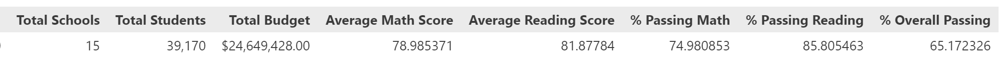
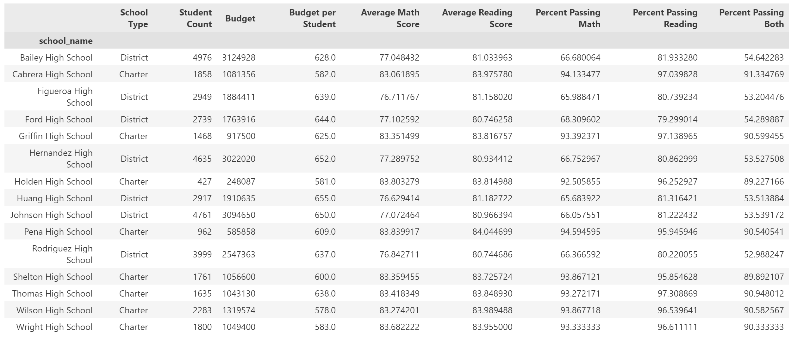
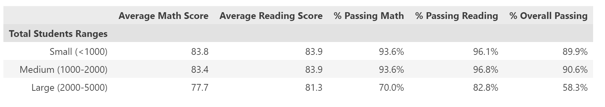

# pandas_challenge
This challenge involves using the powerful pandas library to analyze data from schools in a particular district.  The overall goals were to produce a district summary and individual school summaries.  These are below.

These summaries were then useful for comparing school performance on math and reading tests by school spending, per pupil spending, grade level, and by size and type of school.  I've included a screenshot of a table summarizing student performance on standardized testing based upon the size of the school.

I went back to this project to make the code more efficient after having more experience with python and pandas.  The new "Revised" version is much cleaner.  Thanks to Kelli for helping me see that I could create multiple Data Series and then create DataFrames from these series with identical index values.